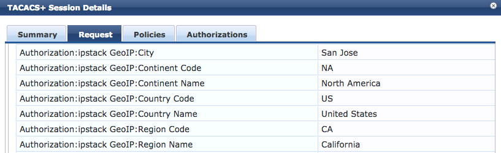

# ClearPass Exchange: ipstack GeoIP Authorization Source

  

## Overview
This is a ClearPass authorization source for leveraging GeoIP data from ipstack in policy.

## Current Version
2018.01 (2018-05-03)

## Change Log
* 2018.01 (2018-05-03)
 _Initial Release_. Tested with ClearPass 6.7.3

## Requirements
* ClearPass 6.7.0+
* ipstack account

## Setup
### ClearPass

1. Download the ipstack authorization source > [clearpass-exchange_ipstack_http-authz.xml](https://raw.githubusercontent.com/aruba/clearpass-exchange-snippets/master/geoip/ipstack/clearpass-exchange_ipstack_http-authz.xml)

2. Log in to the ClearPass admin UI, navigate to  **_Configuration > Authentication > Sources_**, and then click **Import**

3. Browse to find the downloaded file and then click **Import**

4. In the list of Authentication Sources, click **_ipstack GeoIP_**

5. Switch to the **Attributes** tab and click the **_geo-info_** filter

6. In the **Filter Query** box, enter the API key from your ipstack account after the equals sign (ex: %{Connection:Client-IP-Address}?access_key=**fa8298asd9c9023098sdf90ds832**)

7. Click **Save** and then **Save** again to finish

This can now be defined as an additional authorization source and the returned data can be used in role mapping and/or enforcement policies!

## Customization
### Source IP Address
The default authorization source uses the **%{Connection:Client-IP-Address}** variable for the source IP address in the query URL. This is commonly used for TACACS+ workflows.

This variable can be changed based on the desired workflow. In the access tracker request, locate the attribute containing the public IP address. Often times this will be either **Radius:IETF:Framed-IP-Address** or **Radius:IETF:Calling-Station-Id**.

### Attributes
By default, the following data is pulled in as attributes, meaning they will be pulled in regardless of whether they are used in policy. 
* continent_name
* continent_code
* country_code
* country_name
* region_code
* region_name
* city

If any of these attributes are not required in policy, consider either removing them from the authentication source or unchecking the **_Enabled As: Attribute_** checkbox.

## License and Other Information
Copyright (c) Hewlett Packard Enterprise Development LP. All Rights Reserved.

Licensed under the Apache License, Version 2.0 (the "License").

Author: @timcappalli, Aruba Security Group
Organization: Aruba, a Hewlett Packard Enterprise company
