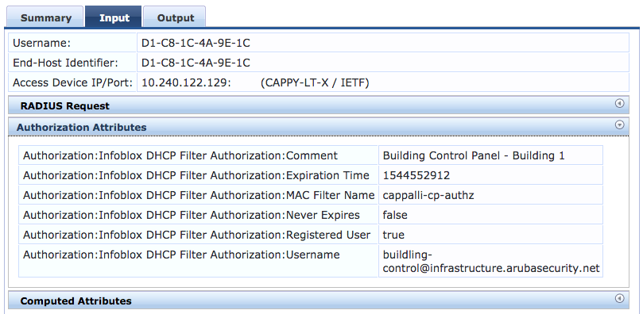

# ClearPass Exchange: Infoblox Authorization Source

  

## Overview
This is a ClearPass authorization source for leveraging data from Infoblox DHCP MAC filters as part of policy.

## Current Version
2017.01 (2017-12-11)

## Change Log
* 2017.01 (2017-12-11)
 _Initial Release. Tested with ClearPass 6.7.0 and Infoblox 8.2.1_

## Requirements
* ClearPass 6.7.0+
* Infoblox DDI

## Setup
### Infoblox Configuration

This section will go through creating a custom API user and access role for ClearPass to use when it queries Infoblox.

1. Log in to Grid Manager and navigate to the **Administration** tab

2. Click the **Roles** tab and then click **+** from the horizontal toolbar

3. Give the role a name, ex: **_DHCP MAC Filter Read Only_**, then click **Next** twice, then **Save & Close**

4. Switch to the **Permissions** tab, click the newly created role in the **_Role_** column and then click **+** from the horizontal toolbar

5. For **Permission Type**, select **DHCP Permissions**, click the checkbox in the **Read-Only** column for **All IPv4 DHCP MAC Filters**, then click **Save & Close**

6. Switch to the **Groups** tab and then click **+** from the toolbar

7. Give the group a name, ex: **_DHCP MAC Filter Read Only_** and click **Next**

8. In the **Roles** section, click **+** and then choose **_Custom Roles_** on the left, then click the role created in the previous steps

9. Uncheck **GUI** and check **API**, click **Next** 3 times and then click **Save & Close**

10. Switch to the **Admins** tab and then click **+** from the toolbar

11. Give the account a username, ex: **_clearpass-authz_** and enter a strong password (randomized is a good security practice)

12. For **Admin Group**, click the **Select** button, click the group created in previous steps, click **Next** and then **Save & Close** to finish

### ClearPass

1. Download the Infoblox authorization source > [clearpass-exchange_infoblox_authz.xml](clearpass-exchange_infoblox_authz.xml)

2. Log in to the ClearPass admin UI, navigate to  **_Configuration > Authentication > Sources_**, and then click **Import**

3. Browse to find the downloaded file and then click **Import**

4. In the list of Authentication Sources, click **_Infoblox DHCP Filter Authorization_**

5. Switch to the **Primary** tab

6. In the **Base URL** field, replace **_'replace.me.with.infoblox.fqdn'_** with the fully qualified domain name of the Infoblox server

7. Replace **Login Username** and **Login Password** with the previously created Infoblox admin credentials

8. Click **Save** to finish

This can now be defined as an additional authorization source and the data can be used in role mapping and/or enforcement policies!

## License and Other Information
Copyright (c) Hewlett Packard Enterprise Development LP. All Rights Reserved.

Licensed under the Apache License, Version 2.0 (the "License").

> Infoblox, the Infoblox logo, Grid, NIOS, bloxTools, NetMRI and PortIQ are trademarks or registered trademarks of Infoblox Inc.

Author: @timcappalli, Aruba Security Group
Organization: Aruba, a Hewlett Packard Enterprise company
