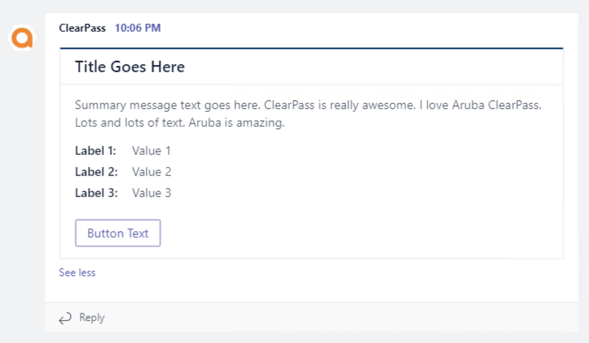

# ClearPass Exchange: Microsoft Teams

  

## Overview
This is an endpoint context server action configuration to send messages to Microsoft Teams via a ClearPass Context Server Action (CSA).

## Current Version
2017.01 (2017-10-10)

## Change Log
* 2017.01 (2017-10-10)
 _Initial Release. Tested with ClearPass 6.6.8._

## Setup
### Teams

1. In Teams, navigate to the channel where alerts will be sent

2. Hover over the channel name and then click the ellipsis and then click **Connectors**

3. Look for 'Incoming Webhook' and click **Configure**

4. Give the webhook a name (ex: ClearPass) and optionally add an icon image

5. Click **Create** to finish

6. Copy the webhook URL at the bottom and save it as it will be required in ClearPass

### ClearPass

1. Download Teams server profile > [clearpass-exchange_microsoft-teams_ecs-csa.xml](clearpass-exchange_microsoft-teams_ecs-csa.xml)

2. Import this context server profile in ClearPass under **_Administration > External Servers > Endpoint Context Servers_**

3. Navigate to **_Administration > Dictionaries > Context Server Actions_**

4. In the Context Server Actions list, look for the action named **Send Message to Teams**, click the check box next to it and click **Copy**

5. Click the newly cloned action

6. Modify the name to best represent the message

6. Look for the URL field. Take the webhook URL from the Teams setup and copy everything after 'https://outlook.office.com/webhook/' and overwrite 'replace-me-replace-me'

7. The content tab contains the JSON payload with the message content. Modify the default text to include the required information

8. Click Save to finish

9. Create an enforcement profile by navigating to Configuration > Enforcement > Profiles > Add

10. Select the HTTP Enforcement template and give it a name

11. On the Attributes tab, select **_outlook.office.com_** as the **Target Server** and for **Action**, select the name of the customized CSA that was created. Click **Save** to finish.

> **NOTE:** A detailed explanation of the message card formatting and all available options is available on the [Microsoft Doc Center](https://docs.microsoft.com/en-us/outlook/actionable-messages/card-reference)

## License and Other Information
Copyright (c) Hewlett Packard Enterprise Development LP. All Rights Reserved.

Licensed under the Apache License, Version 2.0 (the "License").

Author: @timcappalli, Aruba Security Group
Organization: Aruba, a Hewlett Packard Enterprise company
