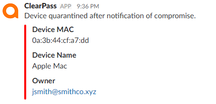

# ClearPass Exchange: Slack

  

## Overview
This is an endpoint context server action configuration to send messages to a Slack channel via a ClearPass Context Server Action (CSA).

## Current Version
2017.01 (2017-10-25)

## Change Log
* 2017.01 (2017-10-25)
 _Initial Release. Tested with ClearPass 6.6.8._

## Setup
### Slack

1. In a browser, navigate to https://my.slack.com/services/new/incoming-webhook/

2. Under **Post to Channel**, select the desired destination channel for the message and then click **Add Incoming WebHooks integration**

3. Take note of the **Webhook URL**. It will be required in ClearPass

4. Under **Integration Settings**, customize the look and feel as desired

5. Click **Save Settings** to finish

### ClearPass

1. Download the Slack context server profile > [clearpass-exchange_slack_ecs-csa.xml](clearpass-exchange_slack_ecs-csa.xml)

2. Import this context server profile in ClearPass under **_Administration > External Servers > Endpoint Context Servers_**

3. Navigate to **_Administration > Dictionaries > Context Server Actions_**

4. In the Context Server Actions list, look for the action named **Send Message to Slack**, click the check box next to it and click **Copy**

5. Click the newly cloned action

6. Modify the name to best represent the message

6. Look for the URL field. Take the webhook URL from the Slack setup and copy everything after 'https://hooks.slack.com/services/' and overwrite 'replace-me-replace-me'

7. The content tab contains the JSON payload with the message content. Modify the default text to include the required information

8. Click **Save** to finish

9. Create an enforcement profile by navigating to **_Configuration > Enforcement > Profiles > Add_**

10. Select the **HTTP Enforcement** template and give it a name

11. On the Attributes tab, select **_hooks.slack.com_** as the **Target Server** and for **Action**, select the name of the customized CSA that was created. Click **Save** to finish.

> **NOTE:** A message template builder is available here: [Slack Message Builder](https://api.slack.com/docs/messages/builder)

## License and Other Information
Slack is a registered trademark of Slack Technologies, Inc.

Copyright (c) Hewlett Packard Enterprise Development LP. All Rights Reserved.

Licensed under the Apache License, Version 2.0 (the "License").

Author: @timcappalli, Aruba Security Group
Organization: Aruba, a Hewlett Packard Enterprise company
